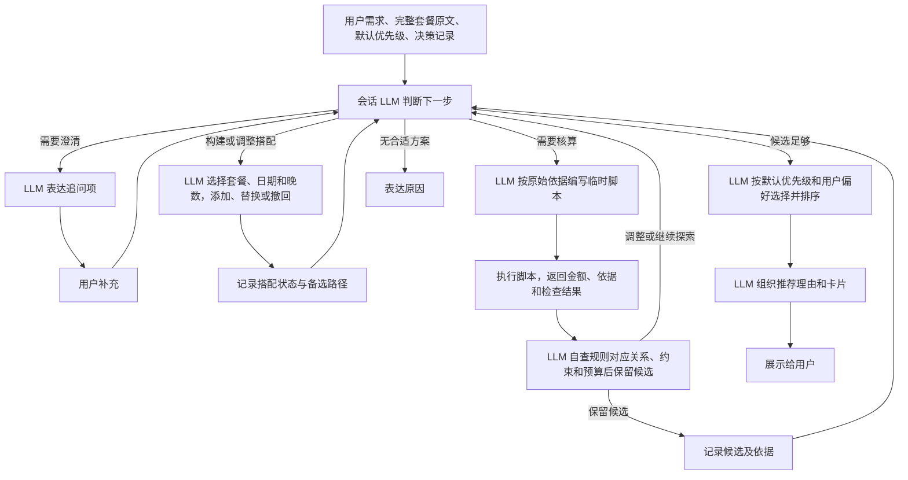

# SNOW-06 · 出行方案闭环：生成、讨论对比、保存与回顾

## 用户确认验收完成

用户明确确认 SNOW-06、SNOW-07、SNOW-08 均已验收完成。本票统一交付的生成、讨论对比、保存与回顾闭环标记为 `completed`，下方验收清单依据本次用户确认勾选；历史决策与原型说明保留作为过程记录。

## 已确认决策（2026-09-24）

本票合并原 SNOW-06、SNOW-07、SNOW-08，以规划、调整、保存、回顾的完整闭环统一交付和验收；07、08 仅保留合并指向，不再独立实施。本票不依赖已暂缓的 SNOW-03。以下范围替代旧规格中仅核算单套餐新增支出的约定。

一份方案是一套满足需求的出行搭配，可以拼接多个套餐；多种搭配是多份独立候选方案，不是同一方案中的互斥选项。费用按天展示。

2026-09-24 修订：移除独立的 Jev 决策模型，由会话 LLM 驱动整个搭配过程的业务判断，包括信息是否充分、追问项、套餐选择、日期与晚数组合、调整与撤回、核算时机、候选保留、停止探索和最终排序；LLM 同时负责整理信息、按需编写临时计算脚本及组织表达。原 Jev 对脚本规则与最终表达的独立审核不再设立，改为技能提示词中的自查要求。以下约定替代旧规格中的固定核算引擎与通用 AI 生成搭配要求；本次仅更新规格，不表示产品已实现。

默认优先级为：满足明确条件 → 整趟总价更低 → 少换酒店 → 少浪费权益。该优先级放在可编辑提示词中，由会话 LLM 结合用户明确偏好判断，不写成固定业务排序代码。调用或脚本执行失败直接展示失败并保留输入，不降级推荐、不自动重试。

## 统一卡片交互要求

本闭环所有面向用户的业务交互均通过设计友好的卡片呈现，不以纯文本回复、Markdown 表格或原始工具结果替代交互。文字说明应在卡片内组织；用户仍可使用会话输入框自由表达需求，零选择也不阻止继续交流。

| 交互场景 | 卡片内容与操作 |
|---|---|
| 信息不足、条件不明确 | 引导卡片展示已知条件、需澄清项与建议选项，允许编辑、留空或继续用自然语言补充 |
| 出行条件与套餐确认 | 可编辑的选填表单、LLM 推荐预勾及更多套餐，唯一主动作“生成方案” |
| 费用估算确认 | 分项展示估算金额、范围与依据，允许修改后接受；未经接受不当作已确认费用 |
| 生成中、计算中、保存中 | 对应卡片显示进行状态，避免重复提交；停止或失败后保留已有输入 |
| 方案推荐 | 每卡一份完整搭配，突出推荐理由、行程与整趟总价，标题下直接展示逐日费用表与计算依据，不折叠，不再单列重复的日期/酒店列表，支持勾选 |
| 单方案讨论、多方案比较、零选择继续交流 | 结构化讨论或比较卡片展示结论、差异与待决项；涉及调整时用可编辑卡片承接，不只输出长段文字 |
| 无合格结果、资料未完成、套餐版本变化 | 状态卡片说明原因及下一步，提供调整条件、补全资料或重新计算的对应入口，不展示已淘汰的超预算方案 |
| 保存成功、部分成功、失败 | 结果卡片逐项区分已保存与未保存，提供查看已存方案或处理失败项的入口，不自动重试 |
| 已存方案回顾、再次规划 | 快照卡片展示当时行程与费用，提供继续调整入口，保留原方案 |

- 一张卡片承担一个清晰任务，设置明确的主动作；不把生成、对比等不同阶段操作堆在同一卡片。结果选择后的“继续讨论”和“保存所选”放在列表统一操作区，按主次区分。
- 优先显示用户决策所需的信息，金额、状态、推荐理由层次清晰；逐日费用与计算依据直接可见，不把整段文本套上边框当作卡片设计。
- 卡片复用现有宿主会话与确认能力，结构化结果驱动展示；历史回放保留当时内容，过期操作不得绕过版本校验。
- 窄屏可读，表单有标签，键盘可操作，状态不只靠颜色表达；加载、空结果和错误状态同样需要设计。

## 会话 LLM 决策与临时脚本核算

- 提供 `snow-plan` 技能及 `snow_evaluate`，编排完整套餐读取、LLM 决策、临时脚本执行与结果记录；不实现固定的套餐组合或计费规则引擎。
- 会话 LLM 读取完整套餐原文、扩展字段、用户需求、已接受估算、默认优先级和已有决策记录。套餐选择覆盖完整集合，日期、晚数提供完整的有界候选。无法确定边界或缺少可选值时由 LLM 决定追问，不能静默截断。
- 会话 LLM 逐步决定选哪个套餐、用哪些日期和晚数、继续添加还是替换或撤回，由这些决策构成候选搭配。保留其他套餐和备选路径，并提供需补充信息、继续探索、撤回与无合适项等出口。候选不得无依据跳过可选套餐，不得静默截断候选空间。
- 直接读取现有 `completeness === 'complete'`，其余套餐不能参与计算；不另建资料完成标准。资料完成不代表日期适用、可拆分、剩余间夜足够或实时有房，这些仍需核验。
- 组合遵守每个套餐的酒店、房型、有效期、不可用日、拆分与剩余间夜约束，不跨套餐套用规则或重复占用权益。
- LLM 决定需要核算后，根据套餐原文、当前搭配与费用依据临时编写脚本并实际执行，返回逐日费用、总价、计算依据及错误；不以模型心算替代执行结果。新增费用和字段由模型读取并按需生成本次脚本，不要求为每项费用修改固定业务代码，不要求将 `ledger.js` 改造成固定核算引擎。
- 技能提示词要求 LLM 自查：脚本所表达的规则须逐条对应原始依据，计算结果、约束及预算核对无误后才能保留候选；表达不得超出脚本结果。脚本提供计算和检查结果，候选淘汰和推荐由 LLM 依据脚本结果决定；规则歧义不能静默变成事实，置信度不等于正确性保证。
- 通用代码只承担状态记录、受限脚本执行、数据完整性与版本校验、卡片和存储等基础能力。临时脚本只获本次计算需要的数据与执行权限，不写套餐、保存方案或执行交易。
- 方案记录所有参与套餐的 ID/revision 与快照。计算时校验输入版本；任一版本过期则停止使用旧结果，提示套餐有变并要求重新计算。

### 已确认流程

任一模型调用或脚本执行失败均进入失败卡片，保留输入，不展示降级候选，不自动重试。正常的业务调整循环与调用失败应区分；运行被停止时保留已有输入和状态，不伪报已完成推荐。

### 场景示例（虚构数据）

用户要求住四晚、至少两晚温泉、整趟预算 2,200 元，并接受交通 300 元、餐饮 240 元的估算。A 为已购可拆分的非温泉套餐，1,200 元／4 晚且剩余四晚；B 为未购温泉套餐，900 元／2 晚，新增文字规则“每次入住另收清洁费 80 元”；C 为未购温泉套餐，1,000 元／2 晚且无额外费用。假设日期均适用。

完整的 A、B、C 与原始规则先交给会话 LLM，由其逐步选定后才形成相应搭配；以下只是核算预期：A 两晚＋B 两晚为 2,120 元，A 两晚＋C 两晚为 2,140 元，B 两晚＋C 两晚为 2,520 元。LLM 临时脚本负责计算清洁费等本次费用，LLM 按脚本结果判断超预算候选不展示，并按用户偏好或默认优先级选择排序。新增清洁费不要求增加固定费用分支。

## 总价与预算

- 预算是整趟出行总价，包含归属于本次出行的已付成本、需新付的套餐费用、补款、交通、餐饮、额外雪票等；已付和待付分别展示，不能重复计费。
- 已购且可拆分套餐按本次使用间夜分摊购入成本。例如 1,200 元买 4 晚、本次使用 2 晚，计入 600 元，同时展示整单金额与分摊依据。整数分分摊须处理尾差，不得凭空增减整单费用。
- 新购且必须整单购买的套餐计入整单价格，单列未使用权益；不能按使用比例低估本次必须发生的购买费用。
- 已付补款按对应日期归属，不明确的不能擅自抵扣或重复加入。
- 交通、餐饮等缺项由 LLM 决定是否请求估算及用户确认，LLM 整理明确标注的估算提案并自查后展示，用户接受或修改后纳入预计总价；遗漏不等于 0，估算不等于来源报价。
- 设置预算后，LLM 根据实际脚本结果判断并淘汰确定超预算的搭配，不展示超预算方案卡片。关键费用未知时先引导补充或确认估算，不输出已符合预算的方案。无结果时引导调整条件，不自动放宽预算。
- 未设预算时允许展示明确标注费用缺项的草稿，但不得以已知小计冒充整趟总价。

## 出行确认与方案选择

- 用户在会话表达出行想法，信息不足时 LLM 决定追问项并引导补充，也可选择直接填写表单。
- 会话内展示可编辑的出行确认卡片，带入已知需求。所有输入选填，不用必填校验阻止提交；只提供一个主动作“生成方案”，不并列“生成”和“对比”。
- 日期、晚数等留空时，LLM 根据对话与套餐条件选择建议条件并明确标注；有依据时可据此生成，无足够依据时继续追问，不能伪装成用户已提供的事实。预算留空表示不限。
- LLM 推荐并预勾资料完整的套餐；用户可取消或通过“更多套餐”加选。套餐全不选表示由 LLM 从资料完整的套餐中挑选。用户明确提出的约束不得自动放宽。
- 由 LLM 逐步构成多份独立搭配，并按推荐顺序排列。每份标题展示整趟总价，下方直接以每日费用表展示日期、酒店/套餐、费用和计算依据，不折叠、不重复展示日期/酒店列表；保留推荐理由与费用摘要，跨天共同费用单列。
- 方案卡片负责展示与勾选，列表下方统一提供“继续讨论”和“保存所选”。选一份时继续讨论该方案，选多份时继续比较，零选择时仍可直接输入新想法。
- 明确区分确认卡片里的“套餐选择”与结果列表里的“方案选择”。讨论和对比复用已有核算，不另建计算分支。
- 上下文保留用户条件、建议条件、已接受估算、选中方案及套餐版本；套餐补全仍走已有会话流程。

不沿用原 2–3 个套餐的选择上限。

## 保存与回顾

用户选中 N 个方案并明确保存，得到 N 份独立方案快照。每份可包含共同组成行程的多个套餐，不把互斥搭配存成一份方案。

- 为既有数据域加入 `plans` 表和 `snow_save_plan`，扩展查询与 `listPlans/getPlan`；沿用 `snow-plan` 指导保存和回顾。
- 保存出行条件、建议条件、逐日安排、套餐 ID/revision 与快照、费用依据、整趟总价、已付/待付拆分、分摊依据、用户接受的估算及未知项。
- 保存时重新检查参与套餐的版本与资料完成状态。套餐有变则该方案不能保存，提示重新计算，不偷偷替换快照；重新计算不等于自动授权保存。
- 多选保存准确返回每份结果，不宣称跨方案原子事务；失败项不展示成功，也不自动重试。
- 工作台已存方案只读展示当时数据。回顾带入原方案快照进入会话；继续调整时准备上下文，等待用户发起计算，使用最新套餐重新核算。
- 重新规划结果经用户保存后生成独立新方案，可关联原方案；原方案不被覆盖。

## 验收

### 组合与核算

- [x] 套餐、日期和晚数的选择及组合过程由会话 LLM 决定，并在会话／决策记录中保留可核对的决策痕迹；固定业务代码不预先生成或筛选候选搭配。
- [x] LLM 能决定追问、核算、调整、撤回、保留候选、停止探索和最终排序，并保留可核对的决策记录。
- [x] 新增文字费用规则（如清洁费）无需增加固定业务代码，能够由 LLM 临时脚本实际计算，且脚本规则与原始依据逐条对应。
- [x] 选项覆盖完整套餐集合和完整的有界日期／晚数候选；缺失选项或边界不明不被悄悄替换为无解。
- [x] 模型调用或脚本执行失败直接显示失败并保留输入，不降级推荐、不自动重试。
- [x] LLM 的追问、估算提案及最终推荐表达不超出脚本结果，不自行增加业务结论或改变已确认的排序依据。

- [x] 资料未完成的套餐在推荐、手动选择及工具调用中均不能参与计算。
- [x] 单套餐与多套餐搭配均能得到逐日行程、费用明细、依据和整趟总价；跨天共同费用单列且不重复计入。
- [x] 正确处理跨日、离店日排除、不可用日期、规则重叠、剩余间夜与拆分限制。
- [x] 已购分摊、新购整单、已付补款归属、0 与未知、估算与事实分别正确表达。
- [x] 有预算时超预算搭配不进入结果；关键费用未知时引导补充，不伪造预算内结论。
- [x] 计算输入版本过期时拒绝使用旧依据；计算不写入套餐或保存方案，不改写历史结果。

### 确认与选择交互

- [x] 引导、估算确认、生成、讨论比较、保存回顾及异常反馈均以对应卡片呈现，不退化为纯文本业务回复或原始工具输出。
- [x] 卡片任务单一、主动作明确，详情按需展开；用户仍可自由输入，不被迫仅靠点击完成交流。
- [x] 卡片的运行、停止、空结果、部分成功、失败与历史回放状态可辨识；窄屏、键盘操作及表单标签通过界面检查。
- [x] 信息不足可通过对话引导或选填表单继续；卡片仅一个生成主动作。
- [x] LLM 推荐预勾可调整，手动加选不能绕过资料完整状态；套餐全不选按交由 LLM 挑选处理。
- [x] 缺失字段不阻止提交，但计算只能使用有依据且明确标注的条件，不编造确定费用。
- [x] 方案按推荐顺序展示，理由具体；逐日费用及依据直接展示，不折叠，超预算方案不显示。
- [x] 零选继续提需求、单选讨论、多选比较都可用；分析不自动保存。
- [x] 套餐或方案上下文准确进入会话；创建或上下文准备失败不发送，重复点击不重复发起。
- [x] 导入待用户发送、新建空白会话的既有行为不受影响。

### 保存与回顾

- [x] 仅分析或讨论不创建方案；明确保存所选 N 份时分别保存 N 份，零选择不保存。
- [x] 每份方案内部是同一行程的套餐搭配，保存内容与用户选中的结果一致。
- [x] 任一参与套餐版本过期、删除或变为资料未完成时，不保存该方案并引导重新计算/补全。
- [x] 估算、已付分摊、原始金额、待付费用和未知项保持原义，不补未知为 0。
- [x] 修改套餐后已存方案保持当时信息；继续规划读取最新数据，另存新方案。
- [x] 写盘失败或批量部分失败准确显示，不重复保存已成功项。
- [x] 存储重开后可读取；不迁移或混入旧 IndexedDB 方案。

## 验证与边界

用场景检查覆盖 LLM 的组合决策、临时脚本费用计算、约束自查与预算判断；运行“持久化查询 → LLM 逐步搭配 → 临时脚本执行 → LLM 自查与排序 → 会话表达”的集成检查。无实时库存、订房、交易或专用优化服务。

在已安装插件走通“对话表达需求 → 选填确认卡片 → 生成组合方案 → 零选讨论/单选讨论/多选比较 → 保存选中 N 份 → 存储重开 → 回顾并重新规划另存”。检查版本变化、无预算内结果、费用未知和批量部分保存失败。

不做后台恢复队列、自动重试、所有套餐版本数据库、旧卡片自动版本提示、外部导出平台或历史数据迁移。

## 实施顺序

在同一票内依次完成共享方案数据、LLM 决策循环与临时脚本执行、会话确认与结果选择、保存与回顾；各阶段复用同一份方案结果及费用口径。最终以完整用户流程验收，不能仅完成核算或界面就关闭本票。

## 原型依据

原型分支 `prototype/plan-loop`，文件 `.scratch/prototypes/plan-loop/throwaway.html`。已更新为卡片式闭环演示：允许拼套餐，整趟预算过滤，逐日费用直接展示，零/单/多选讨论与比较，分别保存所选方案，校验套餐版本并保留旧快照。示例逻辑检查已通过，本轮自动浏览器打开本地文件被安全策略阻止，界面验证待用户体验；不能将原型当作产品验收通过。

[本机打开原型](/Users/liuyunxia/Documents/dsh/huaxue-plan-prototype/.scratch/prototypes/plan-loop/throwaway.html)。仅使用虚构数据与内存，日期、套餐数量和自然语言理解均有限定；详见同目录 `LOGIC.md`。旧版保存互斥套餐为同一方案、仅看新增支出和展示超预算候选的交互已撤销。

该原型早于本轮会话 LLM 全程决策与临时脚本核算约定，仅作为卡片交互参考，不能证明本轮架构或流程已实现。
